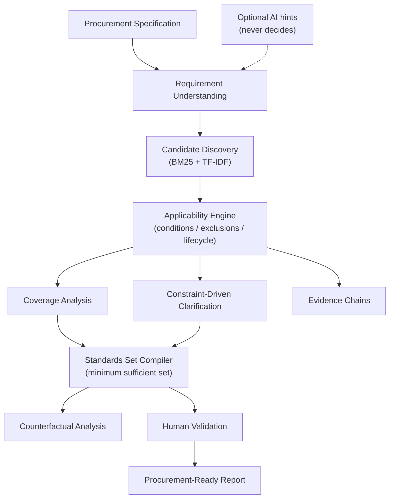

# IS-SCOPE

## Indian Standards Scope & Coverage Engine

> RAG retrieves what looks relevant. IS-SCOPE determines what is applicable, sufficient, and defensible.

SIH 2026 · Problem Statement **SIH26108** — AI-Powered Recommendation Engine for Identifying Applicable Indian Standards for Procurement Specifications.

### Problem

Procurement specifications are often incomplete, ambiguous, or technically complex. Finding semantically similar standards is not enough because applicability depends on scope, conditions, exclusions, lifecycle, dependencies, and the actual requirements.

### Solution

IS-SCOPE converts procurement specifications into an evidence-backed, applicability-checked, and coverage-complete set of Indian Standards.

### Core pipeline

```text
Procurement Specification
↓
Requirement Understanding
↓
Candidate Discovery
↓
Standards Relationship Graph
↓
Applicability Engine
↓
Coverage Analysis
↓
Standards Set Compiler
↓
Clarification / Counterfactual Analysis
↓
Evidence + Human Validation
↓
Procurement-Ready Report
```

### Innovation

**1. Standards Set Compiler.** Instead of merely ranking similar standards, IS-SCOPE compiles a **minimum sufficient applicable set** that covers the procurement requirements while respecting applicability constraints, dependencies, and exclusions. Only `APPLICABLE`/`CONDITIONAL` verdicts are eligible; a role-weighted greedy set cover minimizes the set; the requirement × standard matrix makes sufficiency auditable.

**2. Constraint-Driven Clarification.** When the specification lacks a decision-critical attribute, IS-SCOPE identifies the missing information with the **highest impact on the standards decision** and asks for that first — then deterministically recomputes. This is constraint resolution, not a chatbot.

**3. Counterfactual Standards Analysis.** When a procurement requirement changes, IS-SCOPE recomputes the set and explains **which standards were removed, which were added, and why**. Verified example: `PN16 → PN40` removes `IS-DEM-DIM-12` and adds `IS-DEM-FLANGE-HP-14` with per-standard reasons.

### Architecture



Full detail: [`docs/architecture.md`](docs/architecture.md). Problem background: [`docs/problem-statement.md`](docs/problem-statement.md). Solution rationale: [`docs/solution.md`](docs/solution.md).

**AI proposes → deterministic reasoning verifies → evidence explains → human validates.** The LLM layer (`backend/ai_layer.py`) is an optional terminology-hint stub that returns `None` offline; every applicability, coverage, and set decision is computed deterministically from SQLite metadata. Unknown/invented standard IDs are rejected at the validation endpoint.

### Demo (verified)

Hero scenario: industrial stainless-steel flanged gate valve, high-pressure process service, **PN16**, testing + safety required, temperature deliberately missing, ambiguous "food-grade finish" phrase.

```text
53 Candidates → 23 Relevant → 7 Applicable → 3 Sufficient
coverage 87.5% → 100% after answering the temperature clarification
counterfactual PN16 → PN40: REMOVED IS-DEM-DIM-12, ADDED IS-DEM-FLANGE-HP-14
decoy IS-DEM-VALVE-WTR-09 REJECTED despite lexical similarity (exclusion: potable-water-only vs process service)
```

Step-by-step script: [`docs/demo.md`](docs/demo.md). The 12-beat flow covers: spec → extraction → missing info → retrieval → applicability rejection → coverage matrix → minimum set → clarification recompute → counterfactual → evidence → human approval → HTML/JSON report.

### Quickstart

```powershell
# Backend
cd backend
py -m pip install -r requirements.txt
py seed_data.py
py -m uvicorn main:app --port 8000
# Health check: http://localhost:8000/api/health (should report 64 standards)

# Frontend (second terminal)
cd frontend
npm install
npm run dev
# Open http://localhost:5173 (dev server proxies /api to the backend)
```

No API key, no GPU, no Docker required. Copy `.env.example` to `.env` only if you want to enable optional LLM terminology hints.

### Tech stack (only what is actually in the repo)

| Layer | Technology |
|---|---|
| Backend | FastAPI, Uvicorn, SQLite (stdlib), NetworkX (graph) |
| Frontend | React 18, TypeScript 5, Vite 5 |
| Tests | pytest, FastAPI TestClient (httpx), `backend/acceptance_check.py` (stdlib urllib) |

### Testing

```powershell
cd backend
py -m pytest tests/test_engine.py -q     # deterministic engine tests
py acceptance_check.py http://localhost:8000   # live 13-step demo verification (backend must be running)
cd ../frontend
npm run build   # tsc --noEmit && vite build
```

**Actual results (verified 2026-10-04): backend tests 10/10 · acceptance check 13/13 · frontend production build clean.** Methodology and metric interpretation: [`docs/evaluation.md`](docs/evaluation.md).

### Limitations

Prototype dataset; hand-encoded demo rules; regex extraction; approximate (greedy) set cover; in-memory sessions; human validation mandatory; no legal/compliance determination. Full transparency: [`docs/limitations.md`](docs/limitations.md).

### Data provenance

> Prototype data disclaimer: The current demonstration uses a synthetic/curated standards knowledge base and does not represent an official BIS database. Production deployment would require authorized access to relevant BIS/government data sources.

`backend/seed_data.py` generates 64 metadata-style demo records (`IS-DEM-*` namespace, `is_synthetic_demo = True`); no full BIS standard text is reproduced. Strategy and production ingestion path: [`docs/data-strategy.md`](docs/data-strategy.md).

### Future production path

Authorized BIS/government data integration with a versioned, provenance-tracked ETL pipeline; expert-reviewed scope/exclusion/lifecycle rules; persistent sessions, auth, and audit logging — while keeping the AI-vs-deterministic boundary (models assist, versioned rules decide).

### Repository layout

```text
backend/        FastAPI engine (extraction, retrieval, applicability, coverage,
                graph, clarification, reports) + tests + seed_data.py
frontend/       React + TS + Vite decision-support UI
docs/           architecture, problem-statement, solution, data-strategy,
                evaluation, demo, limitations
sample_spec.txt hero procurement specification
```
