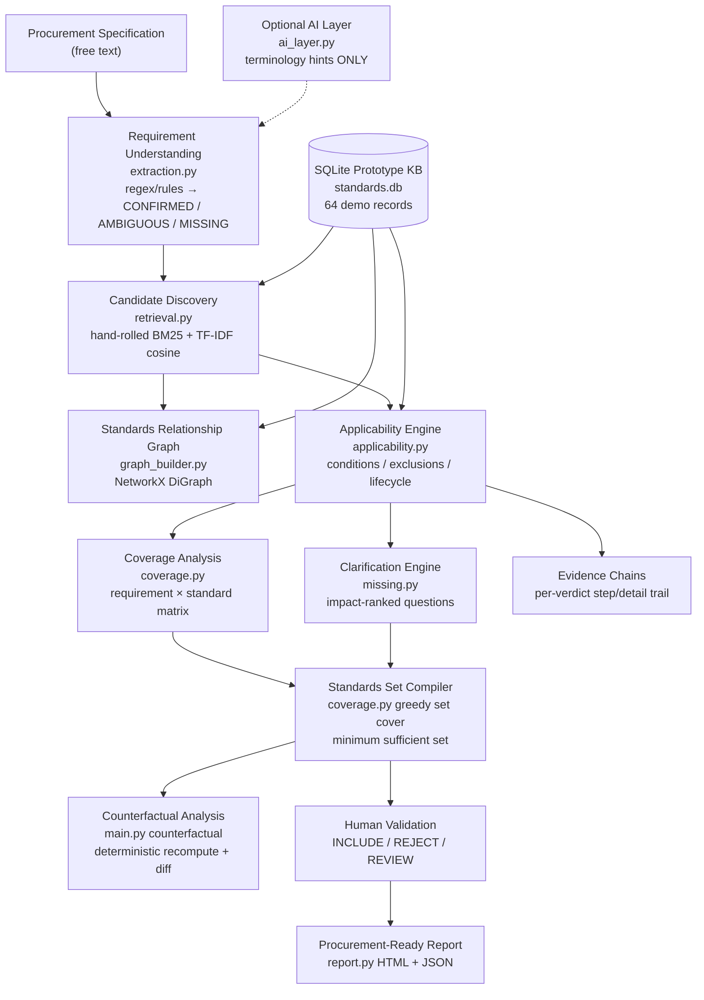

# IS-SCOPE — Architecture

## Overview

## Module map (codebase → concept)

The backend is intentionally flat (one module per concern) so the innovation stays readable on a normal laptop. The conceptual structure maps as follows:

| Concept | Module | Responsibility |
|---|---|---|
| API | `main.py` | FastAPI routes, session store, pipeline orchestration (`_pipeline`, `_pipeline_with_requirements`), counterfactual diff |
| Models / storage | `database.py` | SQLite schema, `fetch_all_standards`, `row_to_standard` |
| Extraction | `extraction.py` | regex/rules → 10-attribute requirement profile with evidence strings; `_canon` normalization |
| Retrieval | `retrieval.py` | hand-rolled BM25 + manual TF-IDF cosine blend, CPU-only, deterministic |
| Applicability | `applicability.py` | lifecycle gate → exclusion gate → condition gate; emits state + evidence chain |
| Graph | `graph_builder.py` | full NetworkX DiGraph + compact per-session subgraph for the UI |
| Coverage | `coverage.py` | `build_matrix` + `greedy_minimum_set` (role-weighted greedy set cover) |
| Compiler | `coverage.py` (`greedy_minimum_set`) + `main.py` funnel | minimum sufficient set over applicable verdicts only |
| Clarification | `missing.py` | `find_missing`: rank blocked attributes by dependent-standard count |
| Counterfactual | `main.py` (`/counterfactual`) | deep-copy requirements, patch one attribute, recompute, diff added/removed/unchanged |
| Evidence | `applicability.py` verdicts + `report.py` | per-standard `evidence_chain`, `blocking_missing`, `reason` |
| AI (optional) | `ai_layer.py` | stub returning `None` offline; may supply terminology hints only — never standard IDs |

No microservices, no Neo4j, no Kubernetes, no GPU models, no cloud services. The prototype runs on a CPU-only 16 GB laptop.

## Request flow

1. `POST /api/analyze` — extract requirements (+ optional LLM hints) → expand query → BM25/TF-IDF search → funnel split (candidates_found / relevant) → applicability over relevant + curated hero IDs → coverage + missing + subgraph → session stored in memory.
2. `GET …/candidates` / `…/coverage` / `…/graph` / `…/missing` — read-only session views.
3. `POST …/clarify` — patch one requirement value via `_canon`, re-run discovery → applicability → coverage with the patched profile.
4. `POST …/counterfactual` — same recompute on a deep copy, then diff selected-set IDs before/after with a generated explanation citing the changed standard's reason.
5. `POST …/validate` — record human INCLUDE / REJECT / REVIEW; unknown standard IDs are rejected (invented IDs cannot enter the set).
6. `GET …/report.json` / `…/report.html` — `report.py` builds the procurement-ready export (HTML escapes all user content).

## Key design decisions

- **Funnel thresholds are explicit constants** (`RELEVANCE_THRESHOLD = 0.12`, whisper threshold `0.02`) in `main.py` — tunable, visible, testable.
- **Hero IDs are pinned into the evaluation set** so the decoy/outdated story is always demonstrable regardless of retrieval cutoff.
- **Lifecycle is a hard gate**: `SUPERSEDED` / `WITHDRAWN` short-circuits to `OUTDATED` before any condition is evaluated.
- **Exclusions are hard rejects**; missing conditions produce `INSUFFICIENT_INFORMATION` with named blockers rather than guesses.
- **Only `APPLICABLE` / `CONDITIONAL` verdicts** feed the coverage matrix and compiler.
- **Sessions are in-memory** (`SESSIONS` dict) — sufficient for a single-evaluator demo; a production deployment would persist sessions.

## Frontend

React + TypeScript + Vite (`frontend/src/`): `App.tsx` (all decision-support views), `api.ts` (typed REST client), `styles.css` (industrial enterprise theme). Dev server proxies `/api` to the FastAPI backend (`vite.config.ts`). No UI framework, no charting library — tables, matrices, decision cards, and a compact SVG graph keep the bundle small (production build ~160 KB JS).
